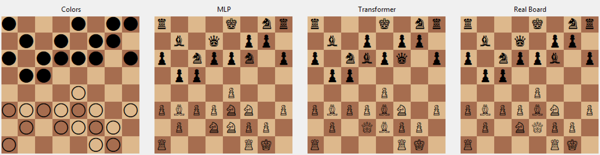
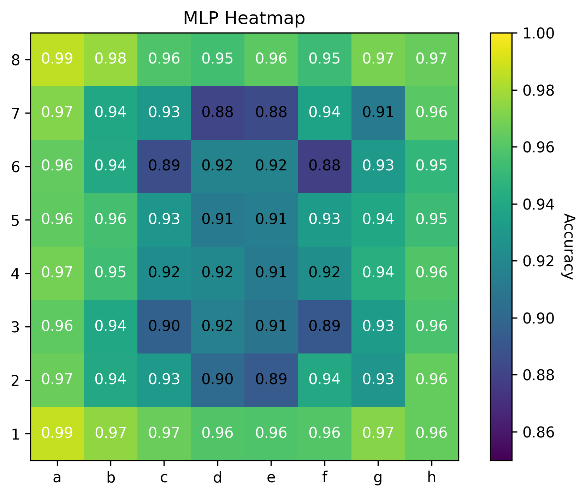
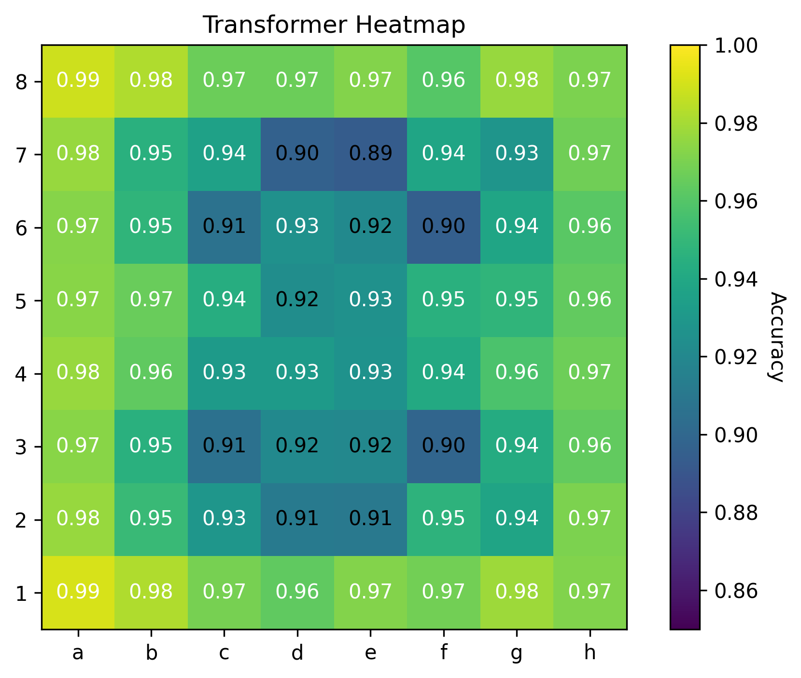

# Chess Board Reconstruction with MLPs and Transformers

## Overview
This project studies whether attention-based models provide advantages over standard neural networks for reconstructing chess positions from partial information. Given only the color of each square, the task is to predict the full piece configuration. This task is partially ill-posed, making it an interesting study for model behavior under ambiguity. We will compare a Multilayer Perceptron (MLP) with a Transformer model built from scratch in PyTorch.

## Problem Setup
**Input:** An 8×8 board where each square is encoded as 100/010/001 for empty/white/black
**Output:** A classification over 13 possible states (empty + 12 piece types) for each square
**Task:** One-shot reconstruction of the full board state.

## Models
**MLP:** Hidden layers 512 -> 256 -> 128, standard ReLU activations and Cross-Entropy Loss. ~370K parameters
**Transformer:** Each square is treated as a token with dimension 64; the input is multiplied by an embedding matrix and added to a positional embedding matrix. 4 transformer blocks are used, each consisting of a 2-headed attention block and an MLP block with hidden layer 256. Output block consists of a linear layer and Cross-Entropy Loss. ~205K parameters

## Dataset
Chess positions are extracted from PGN game files on the lichess database and downloaded as tensors. Training and evaluation both use a dataset of 100K boards.

## Evaluation
| Model | Params | Board Acc | Piece Acc | Correct colors | Regular pieces |
|-------|--------|-----------|-----------|----------------|----------------|
| MLP | 370K | 18.1% | 84.1% | 70.2% | 48.0% |
| Transformer | 205K | **21.0%** | **85.9%** | **100%** | **61.2%** |

Correct colors: percentage of predicted boards where all piece colors match the input.
Regular pieces: percentage where both colors have 1 king and at most 8 pawns, 2 rooks, 2 knights, 2 bishops, 1 queen.

  

  
  

The transformer generally performs slightly better than MLP while having less parameters, though it does also take longer to train.

## Possible Improvements
Add a learned bias to attention scores
Add a token representing global board statistics
Modify loss function (e.g. to enforce piece constraints)
Autoregressive model